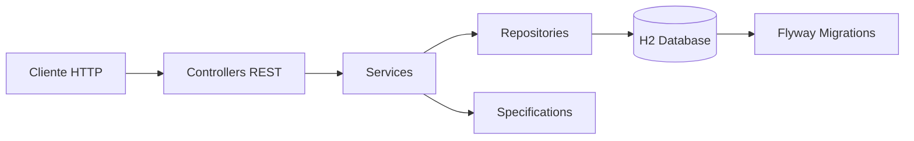
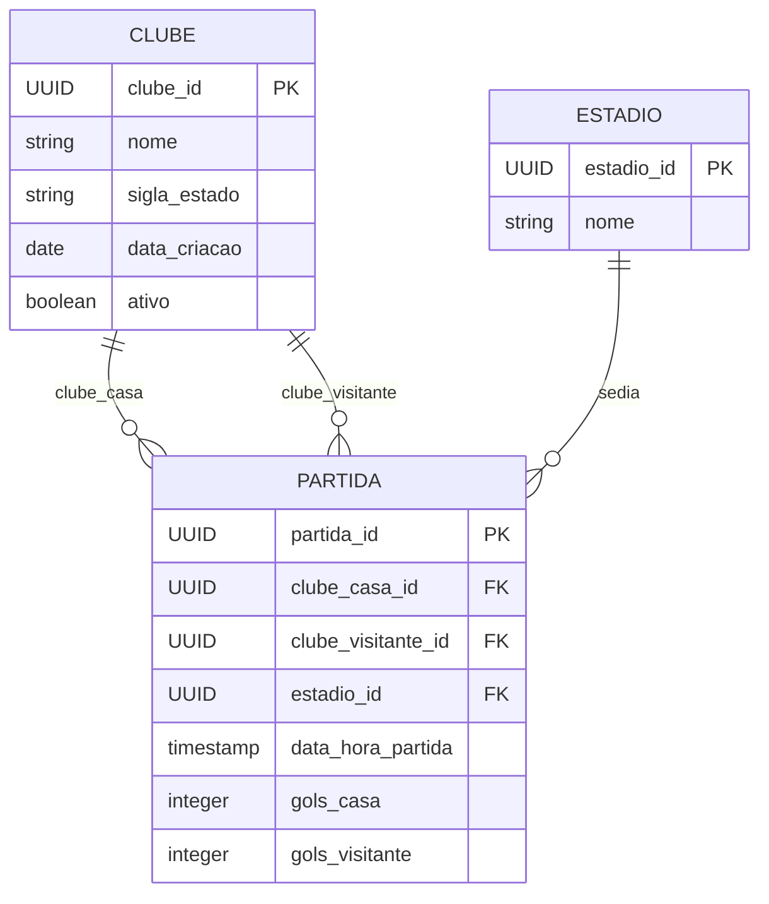

# API de Partidas de Futebol


Projeto de estudos desenvolvido com Java e Spring Boot para praticar a criação de uma API REST completa, com CRUD, validações, filtros dinâmicos, paginação, migrations de banco, consultas agregadas, ranking e retrospecto de clubes de futebol.

> Objetivo principal: consolidar conceitos de backend com Spring Boot em um domínio simples, mas com regras de negócio reais o bastante para exercitar arquitetura em camadas.

---

## Sumário

- [Sobre o projeto](#sobre-o-projeto)
- [Funcionalidades](#funcionalidades)
- [Tecnologias](#tecnologias)
- [Arquitetura](#arquitetura)
- [Modelo de dados](#modelo-de-dados)
- [Como executar](#como-executar)
- [Documentação da API](#documentação-da-api)
- [Endpoints](#endpoints)
- [Exemplos de requisição](#exemplos-de-requisição)
- [Regras de negócio](#regras-de-negócio)
- [Banco de dados e migrations](#banco-de-dados-e-migrations)
- [Testes](#testes)
- [Estrutura do projeto](#estrutura-do-projeto)
- [Aprendizados praticados](#aprendizados-praticados)

---

## Sobre o projeto

A aplicação permite gerenciar clubes, estádios e partidas de futebol. Além do CRUD básico, a API também oferece consultas de retrospecto, confrontos diretos entre clubes e rankings por diferentes critérios.

Este projeto foi criado para estudos, por isso o README também serve como guia de consulta para entender a estrutura do código, os fluxos principais e os recursos do Spring utilizados.

---

## Funcionalidades

| Área | Recursos |
| --- | --- |
| Clubes | Cadastro, atualização parcial, busca por ID, listagem paginada, filtros por nome, estado e status, inativação lógica |
| Estádios | Cadastro, atualização, busca por ID, listagem paginada, filtro por nome, exclusão |
| Partidas | Cadastro, atualização parcial, busca por ID, listagem paginada, filtros por clube, estádio e goleada, exclusão |
| Retrospecto | Estatísticas gerais do clube, por atuação e por adversário |
| Ranking | Ranking por pontos, gols, vitórias ou jogos |
| Banco de dados | Migrations com Flyway, carga inicial e índices para melhorar consultas |
| Documentação | Swagger/OpenAPI e collection Postman |

---

## Tecnologias

| Tecnologia | Uso no projeto |
| --- | --- |
| Java 17 | Linguagem principal |
| Spring Boot 4.0.6 | Base da aplicação |
| Spring Web MVC | Criação dos endpoints REST |
| Spring Data JPA | Persistência e repositories |
| Hibernate | Implementação JPA |
| Bean Validation | Validações com annotations |
| H2 Database | Banco em memória para desenvolvimento e estudos |
| Flyway | Versionamento do schema e carga de dados |
| Springdoc OpenAPI | Swagger UI e contrato da API |
| Lombok | Redução de boilerplate em DTOs e entidades |
| Maven | Gerenciamento de dependências e build |

---

## Arquitetura

O projeto segue uma arquitetura em camadas simples, comum em APIs Spring Boot:



### Responsabilidades por camada

| Camada | Responsabilidade |
| --- | --- |
| `controller` | Recebe requisições HTTP, valida entrada e retorna respostas |
| `service` | Centraliza regras de negócio |
| `repository` | Acessa o banco usando Spring Data JPA |
| `specification` | Monta filtros dinâmicos para listagens |
| `model` | Representa entidades persistidas no banco |
| `dto` | Define contratos de entrada e saída da API |
| `mapper` | Converte entidades em DTOs e DTOs em entidades |
| `exception` / `handler` | Trata erros de domínio e padroniza respostas |

---

## Modelo de dados



---

## Como executar

### Pré-requisitos

- Java 17 ou superior
- Maven instalado
- Git, caso queira clonar o repositório

### Passo a passo

1. Clone o repositório:

```bash
git clone <url-do-repositorio>
cd it-neocamp-projeto-final-workshop
```

2. Execute a aplicação:

```bash
mvn spring-boot:run
```

3. Acesse a API em:

```text
http://localhost:8080
```

### Observação sobre o Maven Wrapper

O projeto possui arquivos `mvnw` e `mvnw.cmd`, mas para usar o wrapper é necessário que a pasta `.mvn/wrapper` esteja completa. Se o wrapper estiver configurado no seu ambiente, também será possível executar:

```bash
./mvnw spring-boot:run
```

---

## Documentação da API

Com a aplicação em execução, acesse:

| Recurso | URL |
| --- | --- |
| Swagger UI | `http://localhost:8080/swagger-ui.html` |
| OpenAPI JSON | `http://localhost:8080/v3/api-docs` |
| H2 Console | `http://localhost:8080/h2-console` |

### Credenciais do H2

| Campo | Valor |
| --- | --- |
| JDBC URL | `jdbc:h2:mem:futeboldb` |
| User Name | `sa` |
| Password | vazio |

Também existe uma collection Postman no arquivo [clubes.postman_collection.json](partidas_futebol.postman_collection.json).

---

## Endpoints

### Clubes

| Método | Endpoint | Descrição |
| --- | --- | --- |
| `POST` | `/clubes` | Cadastra um clube |
| `PUT` | `/clubes/{clubeId}` | Atualiza parcialmente um clube |
| `DELETE` | `/clubes/{clubeId}` | Inativa um clube |
| `GET` | `/clubes/{clubeId}` | Busca um clube por ID |
| `GET` | `/clubes` | Lista clubes com filtros e paginação |
| `GET` | `/clubes/{clubeId}/retrospecto` | Retorna retrospecto geral do clube |
| `GET` | `/clubes/{clubeId}/retrospecto/adversarios` | Retorna retrospecto contra adversários |
| `GET` | `/clubes/{clubeId}/retrospecto/adversarios/{adversarioId}` | Retorna confrontos diretos contra um adversário |
| `GET` | `/clubes/ranking` | Retorna ranking de clubes |

#### Filtros de clubes

```text
GET /clubes?nome=Fla&estado=RJ&ativo=true&page=0&size=10
```

| Parâmetro | Tipo | Descrição |
| --- | --- | --- |
| `nome` | `String` | Filtra por trecho do nome |
| `estado` | `EstadoBrasileiro` | Filtra pela sigla do estado |
| `ativo` | `Boolean` | Filtra clubes ativos ou inativos |
| `page` | `Integer` | Página desejada |
| `size` | `Integer` | Quantidade de itens por página |
| `sort` | `String` | Ordenação, exemplo: `nome,asc` |

#### Parâmetros de retrospecto

```text
GET /clubes/{clubeId}/retrospecto?atuacao=MANDANTE
```

| Parâmetro | Valores | Descrição |
| --- | --- | --- |
| `atuacao` | `MANDANTE`, `VISITANTE` | Opcional. Quando omitido, considera todas as partidas |

#### Parâmetros de ranking

```text
GET /clubes/ranking?tipo=PONTOS
```

| Parâmetro | Valores |
| --- | --- |
| `tipo` | `PONTOS`, `GOLS`, `VITORIAS`, `JOGOS` |

### Estádios

| Método | Endpoint | Descrição |
| --- | --- | --- |
| `POST` | `/estadios` | Cadastra um estádio |
| `PUT` | `/estadios/{estadioId}` | Atualiza um estádio |
| `GET` | `/estadios` | Lista estádios com filtro e paginação |
| `GET` | `/estadios/{estadioId}` | Busca um estádio por ID |
| `DELETE` | `/estadios/{estadioId}` | Remove um estádio |

#### Filtros de estádios

```text
GET /estadios?nomeEstadio=Maracana&page=0&size=10
```

| Parâmetro | Tipo | Descrição |
| --- | --- | --- |
| `nomeEstadio` | `String` | Filtra por trecho do nome |
| `page` | `Integer` | Página desejada |
| `size` | `Integer` | Quantidade de itens por página |
| `sort` | `String` | Ordenação, exemplo: `nome,asc` |

### Partidas

| Método | Endpoint | Descrição |
| --- | --- | --- |
| `POST` | `/partidas` | Cadastra uma partida |
| `PUT` | `/partidas/{partidaId}` | Atualiza parcialmente uma partida |
| `DELETE` | `/partidas/{partidaId}` | Remove uma partida |
| `GET` | `/partidas/{partidaId}` | Busca uma partida por ID |
| `GET` | `/partidas` | Lista partidas com filtros e paginação |

#### Filtros de partidas

```text
GET /partidas?nomeClube=Fla&nomeEstadio=Maracana&goleada=true&page=0&size=10
```

| Parâmetro | Tipo | Descrição |
| --- | --- | --- |
| `nomeClube` | `String` | Filtra por trecho do nome do clube mandante ou visitante |
| `nomeEstadio` | `String` | Filtra por trecho do nome do estádio |
| `goleada` | `Boolean` | Quando `true`, retorna partidas com diferença de 3 ou mais gols |
| `page` | `Integer` | Página desejada |
| `size` | `Integer` | Quantidade de itens por página |
| `sort` | `String` | Ordenação, exemplo: `dataHoraPartida,desc` |

---

## Exemplos de requisição

### Cadastrar clube

```http
POST /clubes
Content-Type: application/json
```

```json
{
  "nome": "Flamengo",
  "estado": "RJ",
  "dataCriacao": "1895-11-15"
}
```

### Cadastrar estádio

```http
POST /estadios
Content-Type: application/json
```

```json
{
  "nome": "Maracana"
}
```

### Cadastrar partida

```http
POST /partidas
Content-Type: application/json
```

```json
{
  "clubeCasaId": "b1b2c3d4-0001-0000-0000-000000000001",
  "clubeVisitanteId": "b1b2c3d4-0002-0000-0000-000000000002",
  "estadioId": "a1b2c3d4-0001-0000-0000-000000000001",
  "dataHoraPartida": "2024-12-20T16:00:00",
  "golsCasa": 2,
  "golsVisitante": 1
}
```

### Consultar ranking

```http
GET /clubes/ranking?tipo=PONTOS
```

### Consultar retrospecto de um clube

```http
GET /clubes/b1b2c3d4-0001-0000-0000-000000000001/retrospecto
```

### Consultar retrospecto por atuação

```http
GET /clubes/b1b2c3d4-0001-0000-0000-000000000001/retrospecto?atuacao=MANDANTE
```

---

## Regras de negócio

### Clubes

| Regra | Comportamento |
| --- | --- |
| Nome obrigatório | Deve ter pelo menos 2 caracteres |
| Estado obrigatório | Deve ser uma sigla válida do enum `EstadoBrasileiro` |
| Data de criação | Deve ser hoje ou uma data passada |
| Duplicidade | Não permite clube com mesmo nome e mesmo estado |
| Inativação | `DELETE /clubes/{id}` altera `ativo` para `false` |

### Estádios

| Regra | Comportamento |
| --- | --- |
| Nome obrigatório | Deve ter pelo menos 3 caracteres |
| Duplicidade | Não permite estádio com mesmo nome |
| Exclusão | `DELETE /estadios/{id}` remove o registro |

### Partidas

| Regra | Comportamento |
| --- | --- |
| Clubes diferentes | Mandante e visitante não podem ser o mesmo clube |
| Clubes existentes | Ambos os clubes precisam existir |
| Clubes ativos | Não é permitido cadastrar partida com clube inativo |
| Estádio existente | O estádio informado precisa existir |
| Conflito de horário | Um clube não pode ter outra partida em intervalo menor que 48 horas |
| Estádio ocupado | Um estádio não pode receber mais de uma partida no mesmo dia |
| Gols | Devem ser números maiores ou iguais a zero |
| Data da partida | Deve ser hoje ou uma data passada |

---

## Banco de dados e migrations

O projeto usa H2 em memória e Flyway para criar e popular o banco a cada execução.

| Migration | Descrição |
| --- | --- |
| `V1__create_tables.sql` | Cria as tabelas `clube`, `estadio` e `partida` |
| `V2__insert_initial_data.sql` | Insere clubes, estádios e partidas iniciais |
| `V3__insert_test_data.sql` | Insere dados adicionais para testes de ranking, goleadas e retrospecto |
| `V4__create_indexes.sql` | Cria índices para otimizar consultas frequentes |

### Índices criados

| Índice | Objetivo |
| --- | --- |
| `idx_clube_sigla_estado_nome` | Melhorar validação e busca por estado/nome |
| `idx_clube_ativo_sigla_estado` | Melhorar filtros e ranking de clubes ativos |
| `idx_estadio_nome` | Melhorar busca e validação por nome do estádio |
| `idx_partida_clube_casa_data` | Melhorar consultas por mandante e data |
| `idx_partida_clube_visitante_data` | Melhorar consultas por visitante e data |
| `idx_partida_estadio_data` | Melhorar validação de estádio ocupado por dia |
| `idx_partida_clubes_casa_visitante` | Melhorar confrontos diretos mandante x visitante |
| `idx_partida_clubes_visitante_casa` | Melhorar confrontos diretos visitante x mandante |

---

## Testes

Para executar os testes:

```bash
mvn test
```

O teste atual sobe o contexto da aplicação e valida que as migrations do Flyway são aplicadas corretamente no banco H2 em memória.

---

## Estrutura do projeto

```text
src
├── main
│   ├── java
│   │   └── com/example/it_neocamp_projeto_final_workshop
│   │       ├── config
│   │       ├── controller
│   │       ├── dto
│   │       ├── enums
│   │       ├── exception
│   │       ├── handler
│   │       ├── mapper
│   │       ├── model
│   │       ├── repository
│   │       ├── service
│   │       └── specification
│   └── resources
│       ├── application.yaml
│       └── db/migration
└── test
    └── java
```

---

## Aprendizados praticados

- Criação de APIs REST com Spring Boot
- Separação de responsabilidades em camadas
- Uso de DTOs para entrada e saída de dados
- Validação com Bean Validation
- Tratamento centralizado de exceções
- Persistência com Spring Data JPA
- Filtros dinâmicos com `Specification`
- Paginação e ordenação com `Pageable`
- Consultas JPQL com agregações
- Relacionamentos `ManyToOne`
- Migrations com Flyway
- Banco H2 em memória
- Documentação com Swagger/OpenAPI
- Otimização básica de consultas com índices

---

## Possíveis evoluções

- Adicionar testes unitários para services
- Adicionar testes de integração dos controllers
- Criar perfil com PostgreSQL ou MySQL
- Adicionar Docker Compose para banco externo
- Implementar autenticação e autorização
- Melhorar buscas textuais com recursos específicos do banco escolhido
- Adicionar logs estruturados
- Criar pipeline de CI

---

## Autor

Projeto desenvolvido para fins de estudo e prática com Java, Spring Boot e desenvolvimento de APIs REST.

